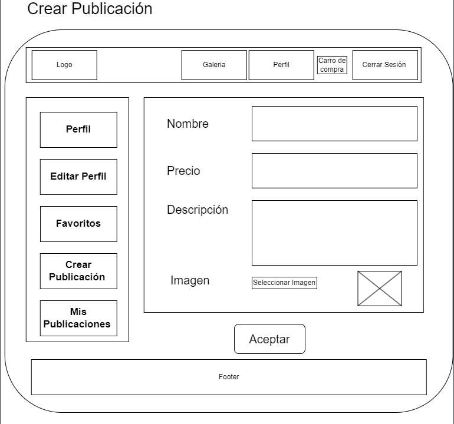
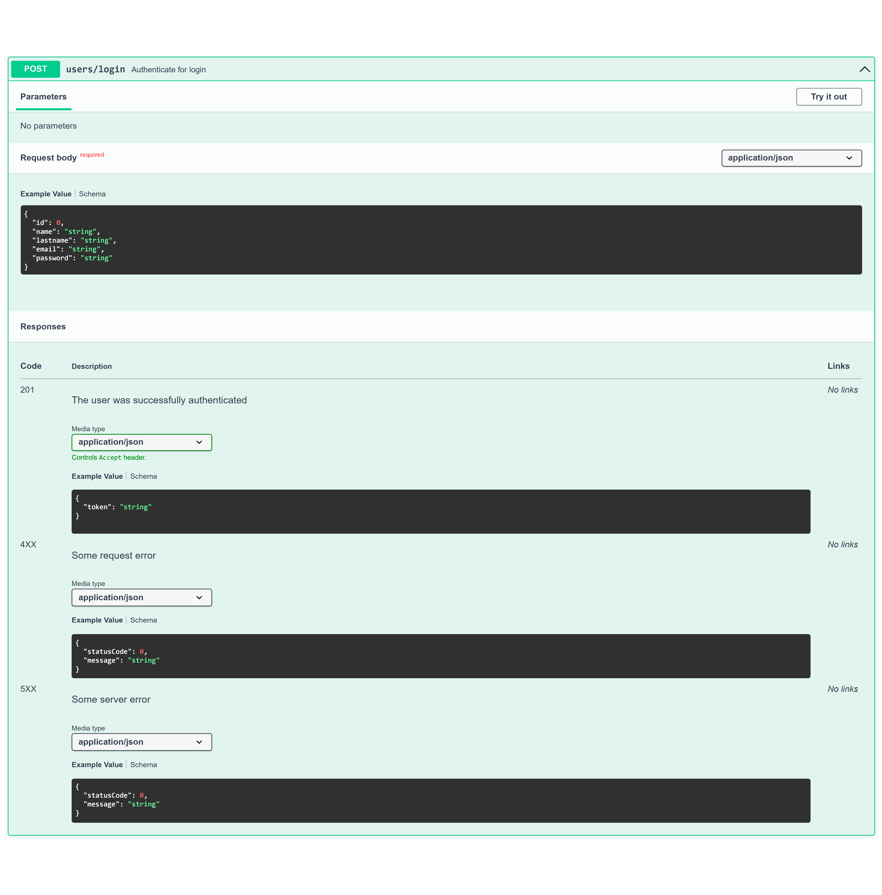

# Proyecto Final - Hito 1

Diseño y prototipo del proyecto


## Integrantes

- **Diego Lorca** 
  [](https://github.com/Dlorcav77)
- **Alex Fernández** 
  [](https://github.com/Arekkusu17)

## Diseño de la Interfaz Gráfica





## Definición de la navegación entre las vistas


*Referente al portal de pagos, estamos analizando si tomarlo como una vista o de otra forma*

## Listado de dependencias a utilizar en el proyecto

**FRONTEND**
```
"dependencies": {
    "@emotion/react": "^11.11.1",
    "@emotion/styled": "^11.11.0",
    "@fontsource/roboto": "^5.0.4",
    "@mui/icons-material": "^5.13.7",
    "@mui/material": "^5.13.7",
    "bootstrap": "^5.3.0",
    "react": "^18.2.0",
    "react-bootstrap": "^2.8.0",
    "react-dom": "^18.2.0",
    "react-router-dom": "^6.14.1"
  }
```
**BACKEND**
```
"devDependencies": { 
    "nodemon": "^2.0.22" 
    "jest": "^28.1.3", 
    "supertest": "^6.2.4" 
  },
"dependencies": {
    "bcryptjs": "^2.4.3", 
    "cors": "^2.8.5", 
    "dotenv": "^16.1.4", 
    "express": "^4.18.2", 
    "jsonwebtoken": "^9.0.0", 
    "morgan": "^1.10.0", 
    "pg": "^8.11.0" 
  } 
```

## Diseño las tablas de la base de datos y sus relaciones.


## Diseñar el contrato de datos de la API REST

Para mayor comodidad se utiliza un archivo PDF para hacer entrega del [Contrato de datos para la API REST](./contrato-api-rest/Contrato-API-Rest.pdf), fue realizado mediante Swagger.

De igual forma, se adjuntan capturas:

**GET /users/{id}**


**PUT /users/{id}**


**POST /users/register**


**POST /users/login**


**GET /products**


**POST /products**


**GET /products/{id}**


**PUT /products/{id}**


**DELETE /products/{id}**


**GET /favorites**


**POST /favorites**


**DELETE /favorites/{id}**
